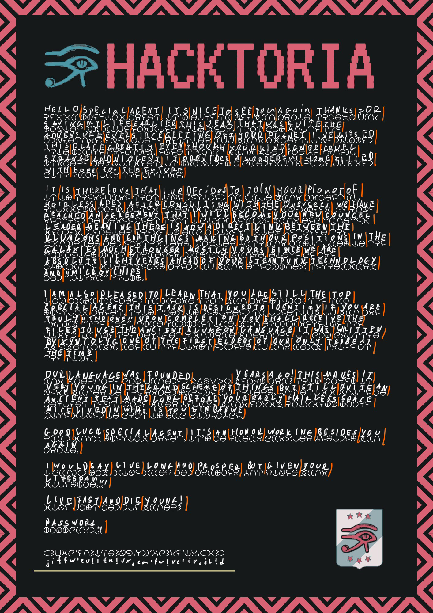

# Klumgongyn Returns (Medium)
> MrMidnight

-----------------------------------------

### Mission Briefing:

```
Greetings Special Agent K. We have a very special assignment for you today. You might remember our old friend Klumgongyn. He’s recently turned up again and will be cooperating with us going forward. In what capacity that collaboration is, I cannot say right now.

All I can tell you, that below you’ll find a text written in ancient Klumgon. It’s up to you to translate the text, which will help you uncover the password for your Link File as well.

Everything else will become clear upon translating the text.

As always. Special Agent K, the contract is yours, if you choose to accept.
```

## 1. Download assets

Download the full image
Download the linkfile 

## 2. Translate the text

The translation is just a process of finding similiar letters to the one we know. Writing them down and add the letters that we can guess, which will make sentences that makes sense. Our translated text should looks like this:




## 2.5 Translation written down 

```
hello special agent. it’s nice to see you again, thanks for
saving my life earlier this year, that was quite the
adventure, ever Since getting off your planet, I’ve missed
this planet greatly, even though your kind can be cruel,
strange and violent, it provides a wonderful home filled
with hope for the future.

it is therefore that I’ve decided too join your planet of
hairless apes, after consulting with the overseer, we have
reached an agreement that i will become your new council
leader, meaning there is now a direct link between the
galaxies much stronger, mostly yours, since we are
absolute lightyears ahead of your steampunk technology
and “micro” chips.

i am also pleased to learn that you are still the top
special agent, this task is designed to identify if yo are
truly “the one”, upon completion, you shall receive the
files to use the ancient kluogen language, it was written
by xyntolyk, one of the first elders of our only tribe at
the time.

our language was founded 105783 Years ago! This makes it
very young in the grand scheme of things, but still quite as
ancient text, made long before your early hairless space
mice lived in what is now zimbabwe.

good luck special agent, it’s an honor working besides you
agent.

I would say, live long and prosper, but given your lifespan...

live fast and die young!

password...

j!fqw'eu!itn!vx,cm'qw!re'ir,jl!d
```

## 3. Getting the flag

The last string contains the password, which we can only get after translating everything:

>j!fqw'eu!itn!vx,cm'qw!re'ir,jl!d

With the password, we can unlock the zip file and get our flag

```
https://bit.ly/3xm6obt
```

